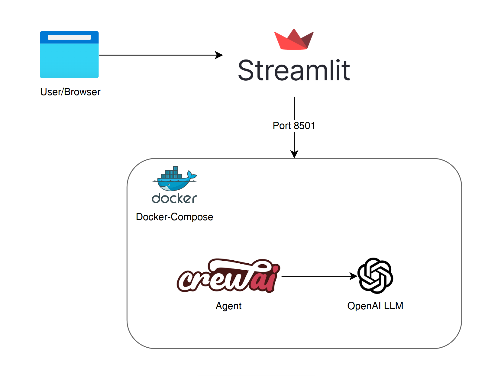

# Terraform AI Code Generator

Este projeto tem como objetivo criar um chatbot de IA para provisionamento de infraestrutura utilizando Terraform. A aplicação permite que o usuário descreva a infraestrutura desejada e, com auxílio de um agente de IA, gera scripts Terraform (HCL) prontos para uso.

## Funcionalidades
- Interface web interativa com Streamlit
- Geração automática de código Terraform a partir de descrições textuais
- Utilização de IA (CrewAI + OpenAI) para interpretar requisitos e criar scripts
- Suporte a múltiplos provedores de nuvem (AWS, GCP, Azure)

## Estrutura do Projeto
```
├── app/
│   └── app.py                  # Frontend Streamlit e integração com agente
├── .dockerignore               # Ignorar .venv no Docker
├── .env                        # Variáveis de ambiente (ex: OPENAI_API_KEY)
├── .gitignore                  # Ignorar arquivos desnecessários no Git
├── .pre-commit-config.yaml     # Configuração do pre-commit
├── .python-version             # Versão do Python utilizada no projeto
├── docker-compose.yml          # Orquestração de container
├── LICENSE                     # Licença do projeto
├── dockerfile                  # Dockerfile para build da aplicação
├── pyproject.toml              # Gerenciamento de dependências com Poetry
├── poetry.lock                 # Lockfile do Poetry
├── README.md                   # Documentação do projeto
```

## Arquitetura



## Pré-requisitos
- Python >= 3.12 < 3.14
- Docker e Docker Compose
- Conta e chave de API OpenAI (para uso do agente)

## Instalação Local
1. Clone o repositório:
   ```bash
   git clone https://github.com/JadesonBruno/da-terraform-code-generator.git
   cd da-terraform-code-generator
   ```
2. Instale o Poetry:
   ```bash
   pip install poetry
   ```
3. Instale as dependências:
   ```bash
   poetry install
   ```
4. Crie um arquivo `.env` na raiz do projeto e adicione sua chave OpenAI:
   ```env
   OPENAI_API_KEY=YOUR_OPENAI_API_KEY
   ```
5. Execute a aplicação:
   ```bash
   poetry run streamlit run app/app.py --server.port=8501 --server.address=0.0.0.0
   ```
6. Acesse [http://localhost:8501](http://localhost:8501) no navegador.

## Execução via Docker
1. Certifique-se de que Docker e Docker Compose estão instalados.
2. Crie o arquivo `.env` com sua chave OpenAI na raiz do projeto.
3. Execute:
   ```bash
   docker-compose up --build
   ```
4. Acesse [http://localhost:8501](http://localhost:8501) no navegador.

## Como funciona
- O usuário insere uma descrição da infraestrutura desejada na interface web.
- O agente de IA interpreta o texto e gera o código Terraform correspondente.
- O resultado é exibido na tela, pronto para ser copiado e utilizado.

## Personalização
- Para alterar o comportamento do agente, adicionar novas funcionalidades ou novos provedores, edite o arquivo `app/app.py`.

## Dicas e Solução de Problemas
- Se o comando `streamlit` não for encontrado no Docker, certifique-se de que o Poetry está instalando as dependências corretamente e que `.venv` não está sendo copiado para o container.
- Sempre rode `poetry lock` após modificar o `pyproject.toml`.
- Para apenas gerenciar dependências (sem empacotamento), use `package-mode = false` no `pyproject.toml`.

## Licença
MIT

## Autor
[Jadeson Bruno Albuquerque da Silva](https://github.com/JadesonBruno)
